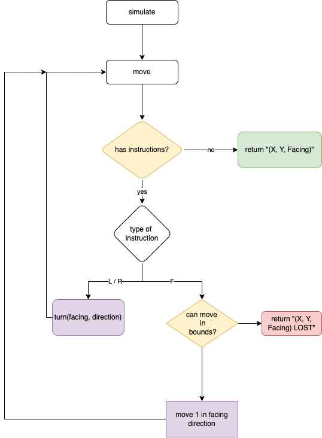

# MarsRover

## How to run this project

```
# install dependencies
mix deps.get

# build escript
mix escript.build
./mars_rover [input_file] 
```

The input_file defaults to 'test_file.txt' in the root of the project.

To run the tests:

```
mix test
```

To build the documentation run:

```
./make_docs.sh

# or 

mix docs
cp -R images/ doc/
```

This generates documentation in `doc/index.html` which you can open in your browser to view, this README is included inside of the generated
documentation as an extra page.

## Approach

When first looking at the problem I saw that moving a robot could be modelled as a state machine where you would step through the instructions
one at a time and apply the relevant action - I've implemented state-machine like logic using a recursive function for simplicity as this is a coding test but in a real life example I would have most likely implemented the robot simulation in a `GenStateMachine` state machine and simulate every robot concurrently as a separate process.

### Parsing the input file

I have chosen to use parser combinators to parse the input file, they provide an easy and powerful way to build up a parser. The parser is in `lib/file_parser.ex`, it uses an `Internal` module to hide away the parser itself - the return value from using the parser is not very nice to work with so I've wrapped it in the simple `parse` function to make it easier.

I've made an effort to wrap the results of the parser in a struct to make pattern matching later on easier.

The file parser is written with a set of parser combinators which i've described with comments in the code 

### Dissecting the MarsRover.Robot module

The main logic for moving a robot lives in this module, its driven by a fairly simple recursive function that steps through the instructions one by one and performs the relevant action. I've added doctests in the file to give examples of how the functions should be used, unfortunately by testing most of the functions I've had to make them visible in the module whereas in a real-world application I would be more selective with visibility to only expose functions that would provide a usable API.

Here is a diagram showing the recursive flow in-case you're a visual thinker, it shows the steps that `move` takes:



* Purple represents a recursive call
* Green represents a successful return
* Red represents a failed return
* Yellow represents a condition

The `move` function has several function clauses:
    * First, the base case - returns the robots final position when there are no instructions left
    * Second, when the instruction is a left or right turn the turn is performed and the function recurses
    * Finally, the main body of the function checks if the robots next move is in bounds (`can_move` function)
        * If in bounds then the robot is moved forward by 1 in one of the four directions according to its facing direction
        * If out of bounds then the robots last position is returned along with the string "LOST" appended

The `do_move` function was natural to write as a series of pattern matches returning a new grid position with a forward movement applied. A similar strategy was used for `can_move` - pattern matching made it easy to compare the new position with the bounds (the size of the grid provided in the input file).

## Future steps

If this simulation was scaled up then I would like to explore how concurrency could be used to manage multiple robots. Assuming that each robot moves in its own grid and overlaps are not relevant then I would create a process for each robot, most likely as state machines which would each run the `simulate` function logic to move their own robots.

If there was an even greater need for scale then you could start to distribute the robot state-machines across a cluster, I've had good success in the past using [swarm](https://github.com/bitwalker/swarm), another library that you could use is [horde](https://github.com/derekkraan/horde) which seems to be maintained more actively as of writing this (18/05/22).

If you wanted, you could wrap this simple library and then provide an API of some form to simulate robots - that would let you plug in a UI of your choice on top.